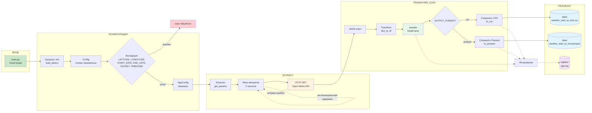

```mermaid
graph LR
    subgraph ВХОД
        A[main.py<br/>точка входа]
    end

    subgraph КОНФИГУРАЦИЯ
        B[Загрузка .env<br/>load_dotenv]
        C[Config<br/>чтение переменных]
        D{Валидация<br/>LATITUDE, LONGITUDE,<br/>START_DATE, END_DATE,<br/>HOURLY, TIMEZONE}
        E[AppConfig<br/>dataclass]
    end

    subgraph EXTRACT
        F[Extractor<br/>get_params]
        G[Retry механизм<br/>5 попыток]
        H[HTTP GET<br/>Open-Meteo API]
    end

    subgraph TRANSFORM_LOAD
        I[JSON ответ]
        J[Transform<br/>dict_to_df]
        K[pandas<br/>DataFrame]
        L{OUTPUT_FORMAT?}
        M[Сохранить CSV<br/>to_csv]
        N[Сохранить Parquet<br/>to_parquet]
    end

    subgraph РЕЗУЛЬТАТ
        O[(data/<br/>weather_start_to_end.csv)]
        P[(data/<br/>weather_start_to_end.parquet)]
        Q[(logfiles/<br/>app.log)]
    end

    A --> B --> C --> D
    D -->|ошибка| R[raise ValueError]
    D -->|успех| E --> F --> G --> H
    
    H --> I --> J --> K --> L
    L -->|csv| M --> O
    L -->|parquet| N --> P
    
    K -.-> S[Логирование]
    M -.-> S
    N -.-> S
    S -.-> Q
    
    G -.->|экспоненциальная<br/>задержка| G
    H -.->|сетевая ошибка| G

    style A fill:#c8e6c9
    style R fill:#ffcdd2
    style H fill:#fff3e0
    style K fill:#e8f5e9
    style O fill:#e1f5fe
    style P fill:#e1f5fe
    style Q fill:#f3e5f5
```
